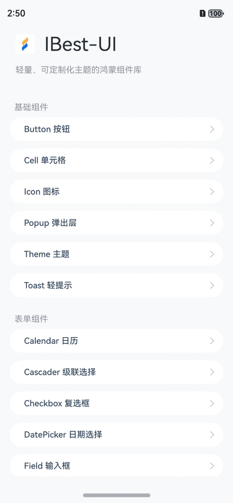

# IBest-UI

## 简介

IBest-UI是一个轻量、简单易用、可定制的鸿蒙开源UI组件库。



## 下载安装

`ohpm install @ibestservices/ibest-ui`

OpenHarmony ohpm 环境配置等更多内容，请参考[如何安装 OpenHarmony ohpm 包](https://gitee.com/openharmony-tpc/docs/blob/master/OpenHarmony_har_usage.md)

## 需要权限
无


## 文档地址

https://ibestui.ibestservices.com/


## 仓库地址
https://gitee.com/ibestservices/ibest-ui

https://github.com/ibestservices/ibest-ui

## QQ群
953492584


## 微信群
先进QQ群，拉你进微信群

## 约束与限制
在下述版本验证通过：
```text
DevEco Studio 5.0.1 Release
Build #DS-233.14475.28.36.505300
构建版本：5.0.5.300, built on November 28, 2024
Runtime version: 17.0.12+1-b1087.25 x86_64
VM: OpenJDK 64-Bit Server VM by JetBrains s.r.o.
macOS 15.1.1
GC: G1 Young Generation, G1 Old Generation
Memory: 2048M
Cores: 12
Metal Rendering is ON
Registry:
  idea.plugins.compatible.build=IC-233.14475.28
Non-Bundled Plugins:
  com.alibabacloud.intellij.cosy (1.4.13)
  com.huawei.deveco.intelligent-assistant (0.408.3)
```

## 开源协议
本项目基于 Apache License 2.0，请自由地享受和参与开源。

## 贡献者
感谢以下同学对iBest-UI做的贡献:

<a href="https://github.com/ibestservices/ibest-ui/graphs/contributors">
  
</a>